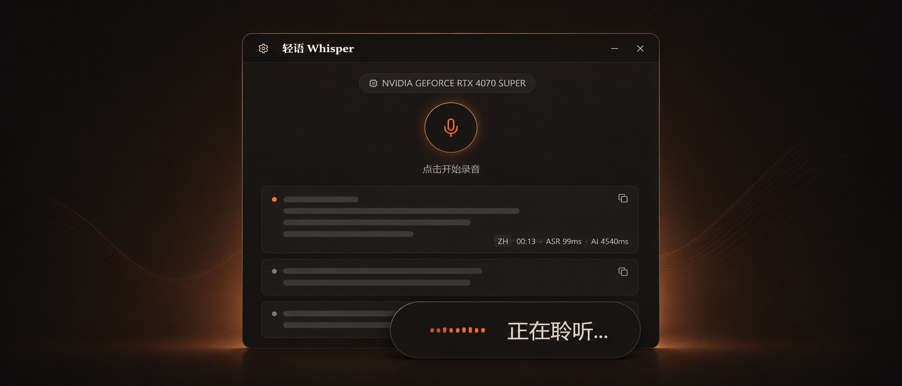

<div align="center">

# Light-Whisper

**Local and cloud speech-to-text for Windows**

[简体中文](README.zh-CN.md) | English

[](https://tauri.app/)
[](https://react.dev/)
[](https://www.rust-lang.org/)
[](LICENSE)

<br>



<br>

**Hold a hotkey, speak, release. Light-Whisper types the result into the active app.**

[Download Installer](https://github.com/sypsyp97/light-whisper/releases/latest)

</div>

## Features

- **One-key dictation**: record with a configurable global hotkey, then type the transcript into the active window.
- **Local and cloud ASR**: run SenseVoice or Faster Whisper locally, or use GLM-ASR / Alibaba DashScope without local models.
- **Raw-first AI polish**: show ASR output quickly, then replace or preview the polished result when the LLM returns. Result cards show ASR, AI, and total latency.
- **Subtitle overlay**: a floating transparent window shows listening, recognition, polishing, web search, and assistant states.
- **Voice assistant**: ask from a separate hotkey, with optional selected text, foreground app, and full-screen screenshot context.
- **Selection and voice editing**: select text with the mouse to translate, explain, improve, copy, or search it; improved text can replace the original selection with one click. Translation supports preset or custom target languages, and voice commands can rewrite selected text in place.
- **Provider flexibility**: built-in OpenAI, DeepSeek, Cerebras, and SiliconFlow presets; custom OpenAI-compatible or Anthropic endpoints; model-native / Exa / Tavily web search for assistant tasks.
- **Personal vocabulary**: hot words, correction learning, and a blacklist for terms you delete manually.

## ASR Engines

| Engine | Runtime | Best for | Language / model | Notes |
|:--|:--|:--|:--|:--|
| **SenseVoice** | Local Python engine | Default low-latency dictation | zh / en / ja / ko / yue | Downloads SenseVoiceSmall + VAD models |
| **Faster Whisper** | Local Python engine | Wider language coverage | large-v3-turbo-ct2, 99+ languages | Downloads Whisper model |
| **GLM-ASR** | Online API | Cloud ASR without local models | `glm-asr-2512` | API key + region endpoint |
| **Alibaba DashScope** | Online API | Qwen ASR / Omni on DashScope | Default `qwen3-asr-flash`; refreshable model list | API key + region + model |

Online ASR engines return final results only and skip the local Python engine startup. Local engines use the bundled Python engine and cached HuggingFace models.

## Installation

### Installer

Download the `*_x64-setup.exe` installer from [Releases](https://github.com/sypsyp97/light-whisper/releases/latest). The installer bundles the app runtime, so no Python or build tools are needed. Local ASR models download on first use.

GPU acceleration is optional. An NVIDIA GPU with a current driver enables CUDA; the app falls back to CPU when no GPU is available.

### Build from Source

Requirements for Windows 10/11 x64:

| Tool | Version | Purpose |
|:--|:--|:--|
| [Visual Studio Build Tools](https://visualstudio.microsoft.com/visual-cpp-build-tools/) | 2019+ | MSVC C++ toolchain |
| [Rust](https://www.rust-lang.org/tools/install) | >= 1.75 | Tauri backend |
| [Node.js](https://nodejs.org/) | >= 18 | Frontend build |
| [pnpm](https://pnpm.io/) | >= 8 | Frontend packages |
| [uv](https://docs.astral.sh/uv/) | >= 0.4 | Python environment for local ASR |

```bash
git clone https://github.com/sypsyp97/light-whisper.git
cd light-whisper

pnpm install
uv sync
pnpm tauri dev
```

Build the installer:

```bash
pnpm tauri build
```

The NSIS installer is written to `src-tauri/target/release/bundle/nsis/`.

Optional local-model prefetch:

```bash
uv run python src-tauri/resources/download_models.py --engine sensevoice
uv run python src-tauri/resources/download_models.py --engine whisper
```

For China mainland downloads, set `HF_ENDPOINT=https://hf-mirror.com` before prefetching.

## Development Commands

```bash
pnpm tauri dev
pnpm tauri build
pnpm build
pnpm test
uv sync
cd src-tauri && cargo check
```

## Troubleshooting

**Hotkey not working**: the current default dictation hotkey is `F2`. Change it in Settings if another app owns it.

**GPU not detected**: check with `.venv\Scripts\python.exe -c "import torch; print(torch.cuda.is_available())"`. Keep the NVIDIA driver current; CUDA Toolkit is not required because PyTorch bundles CUDA.

**Log locations**:

- App log: `%LOCALAPPDATA%\com.light-whisper.desktop\logs\app.log`
- Python ASR logs: `%APPDATA%\com.light-whisper.app\logs\funasr_server.log` / `whisper_server.log`
- Python stderr fallback: `%APPDATA%\com.light-whisper.app\funasr_stderr.log`

## Acknowledgements

- [FunASR](https://github.com/modelscope/FunASR) & [SenseVoiceSmall](https://huggingface.co/FunAudioLLM/SenseVoiceSmall)
- [faster-whisper](https://github.com/SYSTRAN/faster-whisper) & [large-v3-turbo-ct2](https://huggingface.co/deepdml/faster-whisper-large-v3-turbo-ct2)
- [GLM-ASR](https://bigmodel.cn/)
- [Alibaba DashScope](https://www.alibabacloud.com/help/en/model-studio/) & Qwen ASR / Omni
- [Tauri](https://tauri.app/) / [React](https://react.dev/)

## License

[Creative Commons Attribution-NonCommercial 4.0 International (CC BY-NC 4.0)](LICENSE)
