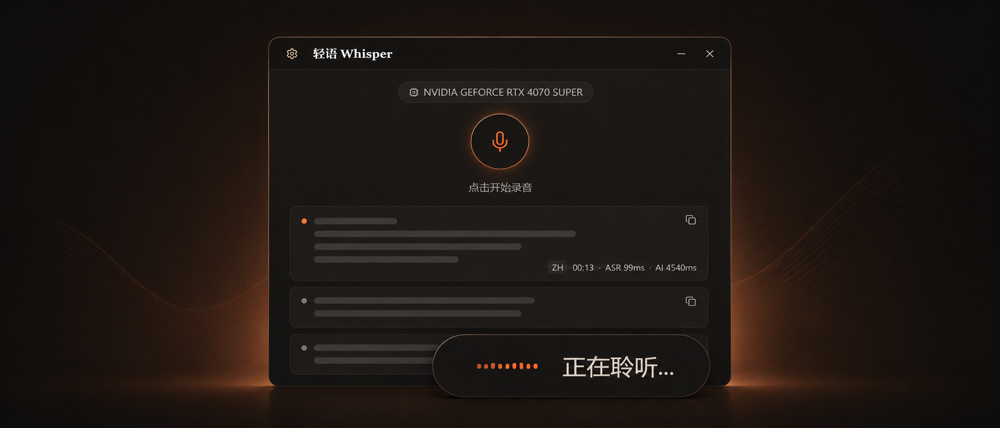

<div align="center">

# Light-Whisper 轻语

**本地与云端语音转文字 · Windows 桌面应用**

简体中文 | [English](README.md)

[](https://tauri.app/)
[](https://react.dev/)
[](https://www.rust-lang.org/)
[](LICENSE)

<br>



<br>

**按下热键，开口说话，松开后文字自动输入到当前应用。**

[下载安装包](https://github.com/sypsyp97/light-whisper/releases/latest)

</div>

## 功能

- **一键听写**：通过可配置全局热键录音，转写后自动输入到当前活动窗口。
- **本地与云端 ASR**：本地运行 Qwen3-ASR Q8，也可使用 GLM-ASR / 阿里 DashScope，免本地模型。
- **AI 润色**：等待 LLM 返回后只输入一次最终结果；四档结构化程度覆盖忠实清理到主动重组，结果卡片显示 ASR、AI 和总耗时。
- **字幕悬浮窗**：透明浮窗显示听写、滚动识别、润色、联网搜索和助手状态；中间结果仍通过稳定前缀减少跳动，字幕正文统一使用高对比度颜色显示。
- **语音助手**：独立热键唤起，可选读取选中文本、前台应用和全屏截图作为上下文。
- **划词与语音编辑**：鼠标划词后可翻译、解释、优化、复制或搜索；优化结果可一键替换原选区。翻译目标支持预设和自定义语言，语音指令也可原地改写选中文字。
- **模型与搜索配置**：内置 OpenAI、DeepSeek、Cerebras、SiliconFlow；支持自定义 OpenAI 兼容或 Anthropic 端点；助手支持模型内置搜索、Exa、Tavily。
- **个人词库**：热词、结构化纠错学习，以及手动删除词条的黑名单。

## ASR 引擎

| 引擎 | 运行方式 | 适合场景 | 语言 / 模型 | 说明 |
|:--|:--|:--|:--|:--|
| **Qwen3-ASR 0.6B Q8** | 本地 GGUF 引擎 | 速度优先的 Qwen 听写 | 多语言，Q8_0 | 独立下载约 850 MB；内置 FireRedVAD；CUDA / Vulkan / CPU |
| **Qwen3-ASR 1.7B Q8** | 本地 GGUF 引擎 | 更偏质量的 Qwen 选项 | 多语言，Q8_0 | 独立下载约 2.19 GB；内置 FireRedVAD；CUDA / Vulkan / CPU |
| **GLM-ASR** | 在线 API | 免本地模型的云端 ASR | `glm-asr-2512` | API Key + 区域端点 |
| **阿里 DashScope** | 在线 API | DashScope 上的 Qwen ASR / Omni | 默认 `qwen3-asr-flash`；模型列表可刷新 | API Key + 区域 + 模型 |

在线 ASR 引擎只返回最终结果，并跳过本地 Python 引擎启动。本地引擎使用打包的 Python 引擎和缓存的 HuggingFace 模型。

Qwen 权重会在首次使用时单独下载，并从模型缓存中复用。FireRedVAD 已随应用内置，不需要另外下载 VAD 模型。0.6B 更轻量，1.7B 模型更大；两者都支持个人热词，优先使用 CUDA，并可回退到 Vulkan/CPU。

## 安装

### 安装包

从 [Releases](https://github.com/sypsyp97/light-whisper/releases/latest) 下载 `*_x64-setup.exe`。安装包已包含应用运行时，无需安装 Python 或编译工具。本地 ASR 模型会在首次使用时下载。

GPU 加速是可选项。NVIDIA 显卡配合较新的驱动可启用 CUDA；无 GPU 时应用自动回退 CPU。

### 从源码构建

Windows 10/11 x64 环境要求：

| 工具 | 版本 | 用途 |
|:--|:--|:--|
| [Visual Studio Build Tools](https://visualstudio.microsoft.com/zh-hans/visual-cpp-build-tools/) | 2019+ | MSVC C++ 编译链 |
| [Rust](https://www.rust-lang.org/tools/install) | >= 1.75 | Tauri 后端 |
| [Node.js](https://nodejs.org/) | >= 18 | 前端构建 |
| [pnpm](https://pnpm.io/) | >= 8 | 前端包管理 |
| [uv](https://docs.astral.sh/uv/) | >= 0.4 | 本地 ASR 的 Python 环境 |

```bash
git clone https://github.com/sypsyp97/light-whisper.git
cd light-whisper

pnpm install
uv sync
pnpm tauri dev
```

构建可分发安装包。Python 引擎归档不会提交到 Git，因此需要先构建：

```bash
uv run --locked python scripts/build_engine.py
pnpm tauri build
```

NSIS 安装包会输出到 `src-tauri/target/release/bundle/nsis/`。
`pnpm tauri build` 会拒绝缺失、空文件或并非 XZ 格式的引擎归档，不再静默生成缺少本地 ASR 的安装包。如果补丁版本没有改动打包进引擎的 Python 运行时代码，可以复用已经验证过的 `engine.tar.xz`。

可选的本地模型预下载：

```bash
uv run python src-tauri/resources/download_models.py --engine qwen3-asr-0.6b
uv run python src-tauri/resources/download_models.py --engine qwen3-asr-1.7b
```

国内下载可在预下载前设置 `HF_ENDPOINT=https://hf-mirror.com`。

## 开发命令

```bash
pnpm tauri dev
pnpm check
pnpm build
pnpm test
uv sync
cd src-tauri && cargo check
```

## 排障

**热键没反应**：当前代码里的默认听写热键是 `F2`。如果被其他应用占用，可在设置中修改。

**GPU 未检测到**：运行 `nvidia-smi`。Qwen3-ASR 的实际设备/后端记录在 `qwen3_asr_server.log`。

**日志位置**：

- 应用日志：`%LOCALAPPDATA%\com.light-whisper.desktop\logs\app.log`
- Qwen3-ASR 日志：`%TEMP%\light_whisper_logs\qwen3_asr_server.log`
- Python stderr 兜底日志：`%APPDATA%\com.light-whisper.app\funasr_stderr.log`

## 致谢

- [Qwen3-ASR](https://github.com/QwenLM/Qwen3-ASR) & [transcribe.cpp](https://github.com/handy-computer/transcribe.cpp)
- [FireRedVAD](https://huggingface.co/FireRedTeam/FireRedVAD)
- [GLM-ASR](https://bigmodel.cn/)
- [Alibaba DashScope](https://www.alibabacloud.com/help/zh/model-studio/) & Qwen ASR / Omni
- [Tauri](https://tauri.app/) / [React](https://react.dev/)

## 许可证

Light-Whisper 是采用 [GNU General Public License v3.0 only](LICENSE) 的开源软件。
个人、组织和企业均可使用，包括商业使用。无论是否修改，以源代码或编译形式分发时都必须
遵守 GPL；分发二进制版本时，应按其条款要求提供对应源代码。
已经发布的旧版本继续适用其发布时附带的许可证。

第三方软件、模型和字体继续适用各自的许可证，详见 [NOTICE](NOTICE) 和
[THIRD_PARTY_NOTICES.md](THIRD_PARTY_NOTICES.md)。
